---
## Front matter
title: "Отчет по лабораторной работе №2"
subtitle: "Дисциплина: Архитектура компьютера"
author: "Баазова Нина Эдгаровна"

## Generic otions
lang: ru-RU
toc-title: "Содержание"

## Bibliography
bibliography: bib/cite.bib
csl: pandoc/csl/gost-r-7-0-5-2008-numeric.csl

## Pdf output format
toc: true # Table of contents
toc-depth: 2
lof: true # List of figures
lot: true # List of tables
fontsize: 12pt
linestretch: 1.5
papersize: a4
documentclass: scrreprt
## I18n polyglossia
polyglossia-lang:
  name: russian
  options:
	- spelling=modern
	- babelshorthands=true
polyglossia-otherlangs:
  name: english
## I18n babel
babel-lang: russian
babel-otherlangs: english
## Fonts
mainfont: PT Serif
romanfont: PT Serif
sansfont: PT Sans
monofont: PT Mono
mainfontoptions: Ligatures=TeX
romanfontoptions: Ligatures=TeX
sansfontoptions: Ligatures=TeX,Scale=MatchLowercase
monofontoptions: Scale=MatchLowercase,Scale=0.9
## Biblatex
biblatex: true
biblio-style: "gost-numeric"
biblatexoptions:
  - parentracker=true
  - backend=biber
  - hyperref=auto
  - language=auto
  - autolang=other*
  - citestyle=gost-numeric
## Pandoc-crossref LaTeX customization
figureTitle: "Рис."
tableTitle: "Таблица"
listingTitle: "Листинг"
lofTitle: "Список иллюстраций"
lotTitle: "Список таблиц"
lolTitle: "Листинги"
## Misc options
indent: true
header-includes:
  - \usepackage{indentfirst}
  - \usepackage{float} # keep figures where there are in the text
  - \floatplacement{figure}{H} # keep figures where there are in the text
---

# Цель работы

Изучить идеологию и применение средств контроля версий. Приобрести практические навыки по работе с системой git. 

# Выполнение лабораторной работы

1. Настройка github. 
Вхожу в свой аккаунт на сайте https://github.com. 

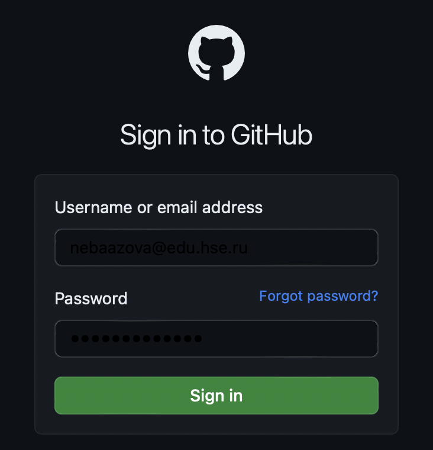{#fig:001 width=70%}

2. Базовая настройка git.
Для начала сделаем предварительную конфигурацию git. Откроем терминал и введём команды: git confing  - -global user.name “<Name Surname>” (указав своё имя с фамилией) и git confing  - -global user.emаil “<work@mail>” (указав свою электронную почту). Затем настроим utf-8 в выводе сообщений git и зададим имя начальной ветки, которой назовём master. Введём параметры: autocrlf, safecrlf (рис 2.1). 

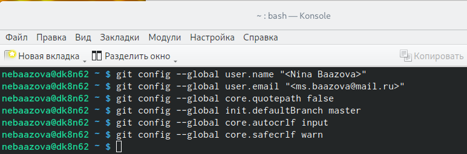{#fig:002 width=70%}

3. Создание SSH ключа. 
Для последующей идентификации пользователя на сервере репозиториев необходимо сгенерировать пару ключей (приватный и открытый): ssh-keygen “Name Surname <work@mail>” (указав своё имя и фамилию, электронную почту). Этот ключ автоматически сохранится в каталоге ~/.ssh/. 

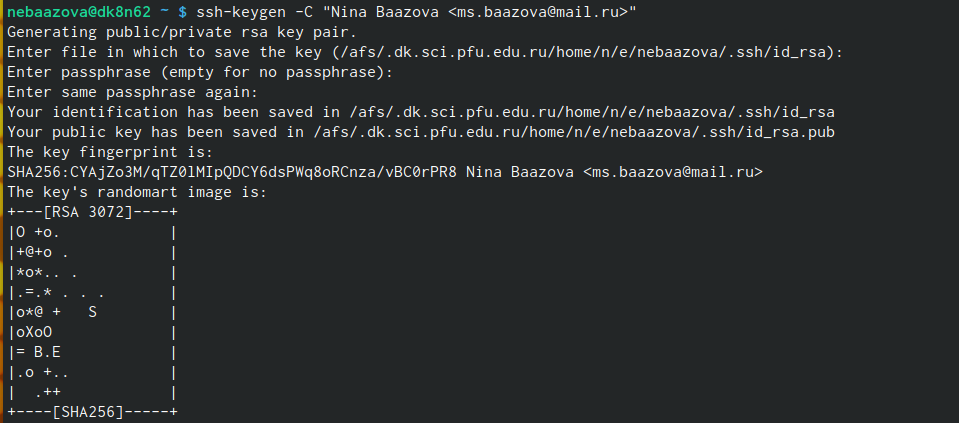{#fig:003 width=70%}

Далее необходимо загрузить сгенерированный открытый ключ. Заходим на github, находим под своей учётной записью Setting, затем в боковом меню выбираем SHH and GPG keys и нажимаем кнопку New SSH key. Скопировав из локальной консоли ключ в буфер обмена: cat ~/.ssh/id_rsa.pub | xclip -sel clip. Вставляем ключ в появившееся на сайте поле и указываем для него имя. 

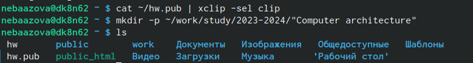{#fig:004 width=70%}
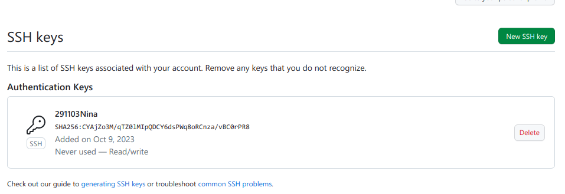{#fig:005 width=70%}

4. Создание рабочего пространства и репозитория курса на основе шаблона. 
1). Откроем терминал и создадим каталог для предмета, воспользовавшись командой: mkdir -p ~/work/study/2023-2024/”Computer architecture”. 

{#fig:006 width=70%}

2). Создаём репозиторий на основе с шаблона. Заходим в браузер на страницу репозитория. Выбираем Use this template. В открывшемся окне называем репозиторий, затем нажимаем на Create repository from template (рисунок 4.2.1). Далее откроем терминал и перейдём в каталог курса с помощью команды: cd ~/work/study/2023-2024/”Computer architecture”. Затем клонируем созданный репозиторий (рисунок 4.2.2). Скопируем ссылку на странице созданного репозитория Code - > SSH для клонирования (рисунок 4.2.3).

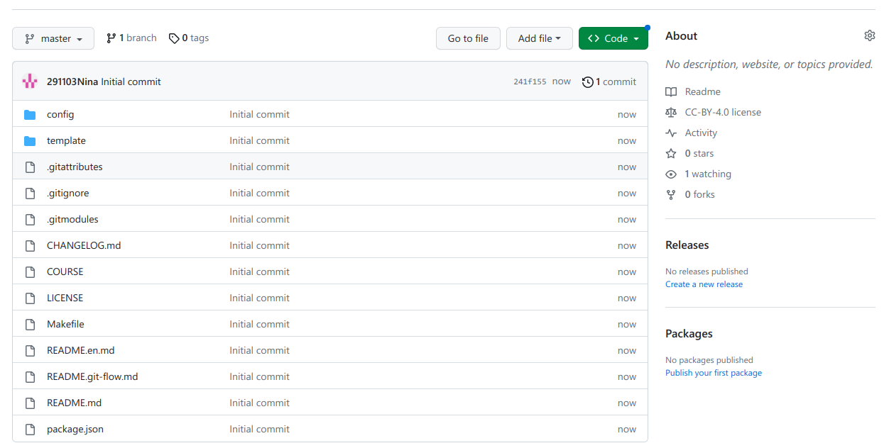{#fig:007 width=70%}
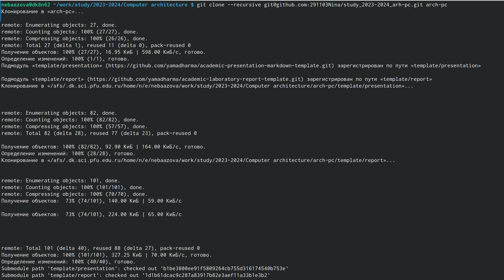{#fig:008 width=70%}
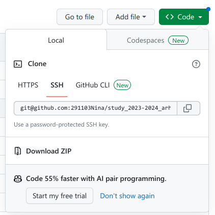{#fig:009 width=70%}

5. Настройка каталога курса. 
Перейдём в каталог курса, удалим лишние файлы и создадим необходимые каталоги (рис 5.1). Далее отправим файлы на сервер. Затем проверим создание нужной иерархии рабочего пространства в локальном репозитории и на странице github. 

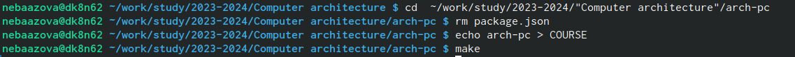{#fig:010 width=70%}
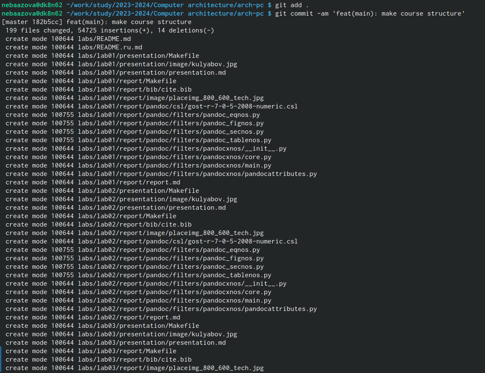{#fig:011 width=70%}
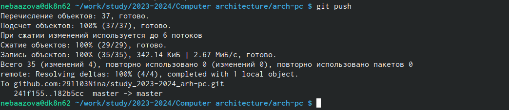{#fig:012 width=70%}
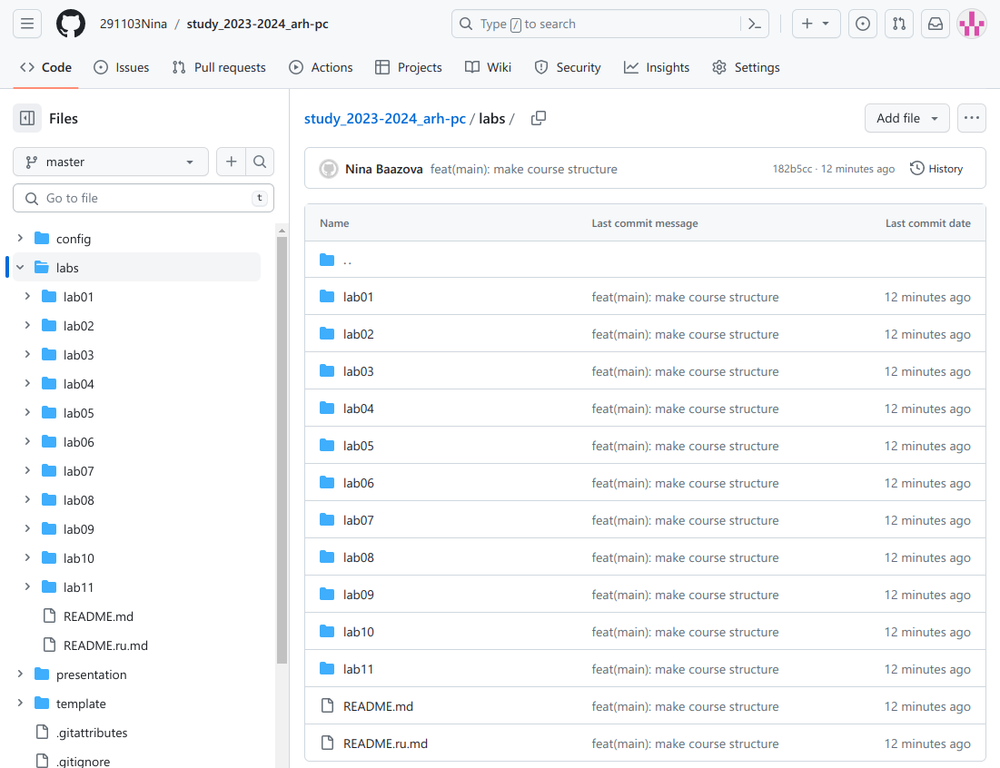{#fig:013 width=70%}

ВЫВОД: Мы научились пользоваться сайтом  https://github.com, ознакомились с основными командами git. 

6. Задание для самостоятельной работы
ЦЕЛЬ: Создание отчёта по выполнению лабораторной работы в соответствующем каталоге рабочего пространства (labs>lab02>report). Копирование отчёта по выполнению предыдущих лабораторных работ в соответствующие каталоги созданного рабочего пространства. Загрузка файлов на github. 
Для начала переходим в директорию labs>lab02>report с помощью команды cd. Создадим файл для отчёта по второй лабораторной работе, воспользовавшись командой touch (рис 6.1). 

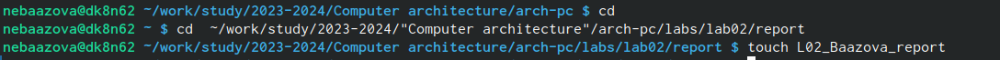{#fig:014 width=70%}

Написать отчёт мы можем в текстовом процессоре LibreOffice Writer. После открытия текстового редактора находим наш файл. Теперь мы можем работать в нём (рис 6.2). 

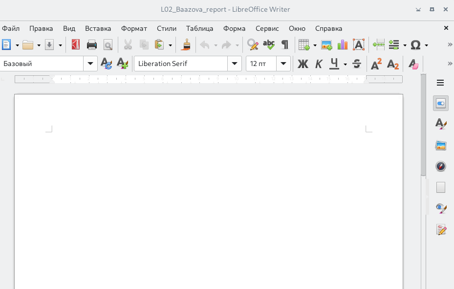{#fig:015 width=70%}

Переходим командой cd из подкаталога lab02/report в подкаталог lab01/report (рис 6.3). Затем можем проверить местонахождение файлов с отчётами по первой лабораторной работе. Он должен быть в подкаталоге домашней директории Документы (рис 6.4). Проверяем выполнения команд с помощью cd и ls (рис 6.5). 

{#fig:016 width=70%}
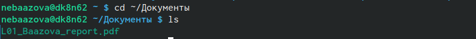{#fig:017 width=70%}
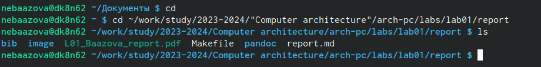{#fig:018 width=70%}

Добавляем файл L01_Baazova_report.pdf и сохраняем изменения, написав, что добавили файл (рис 6.6). Затем отправляем в центральный репозиторий сохраненных изменений (рис 6.7). Проверяем наши действия на сайте github (рис 6.8). 

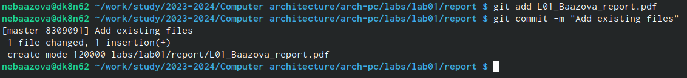{#fig:019 width=70%}
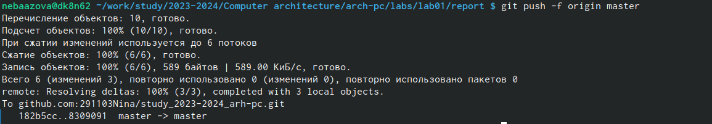{#fig:020 width=70%}
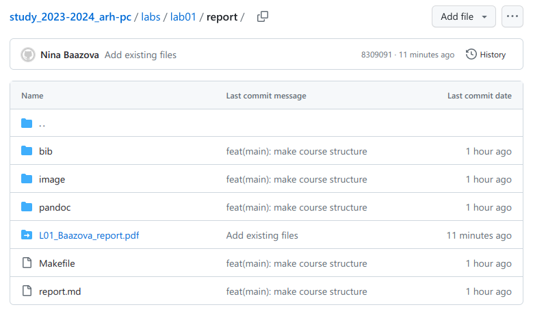{#fig:021 width=70%}

То же самое проделаем и со второй лабораторной работой. Перейдём в директорию labs/lab02/report с помощью команды cd, затем добавляем нужный файл. Потом также отправляем в центральный репозиторий сохранённые изменений (рис 6.9) и проверяем правильность на сайте (рис 6.10). 

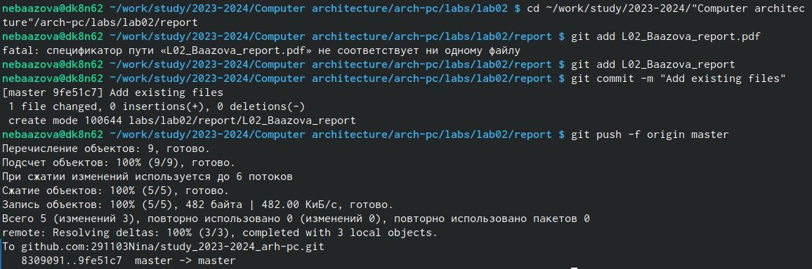{#fig:022 width=70%}
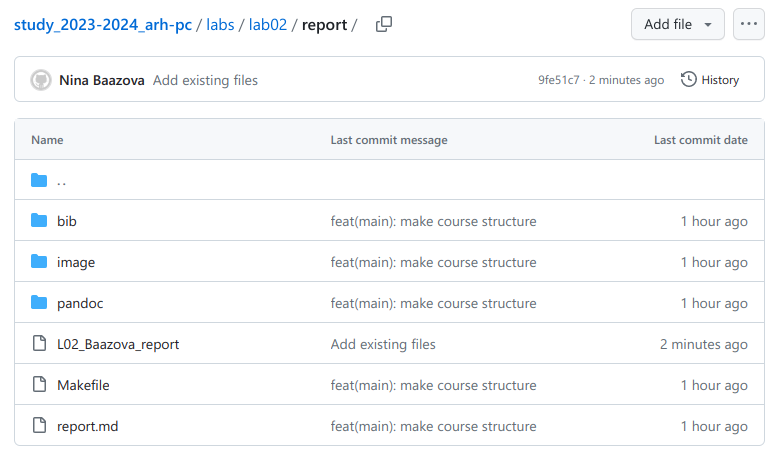{#fig:023 width=70%}
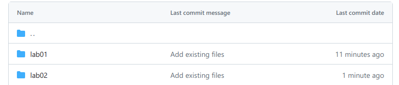{#fig:024 width=70%}

ВЫВОД: Мы сделали самостоятельную работу, создав отчёт по выполнению лабораторных работ в пронумерованный каталог, скопировав отчёт по выполнению предыдущих лабораторных работ в соответствующие каталоги созданного рабочего пространства, загрузив файлы на сайт github. 

# Вывод
Mы изучили идеологию и применение средств контроля версий и приобрели практические навыки по работе с системой git.

