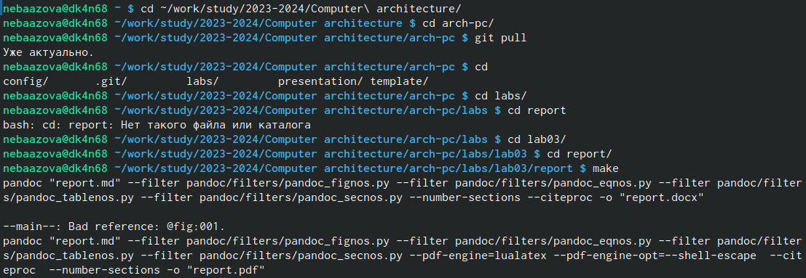
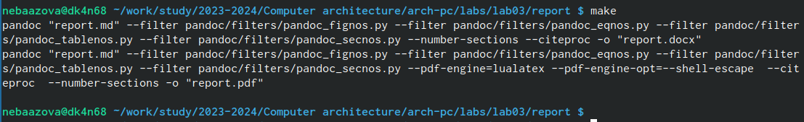
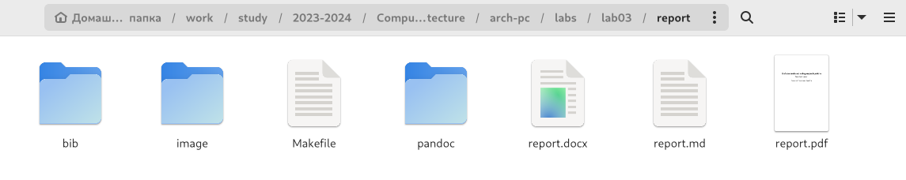
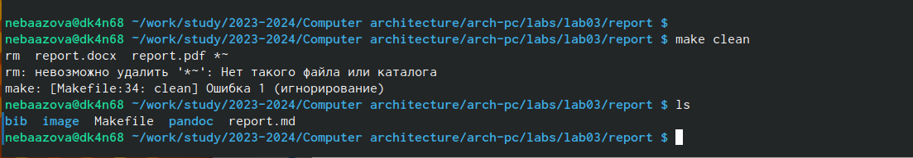
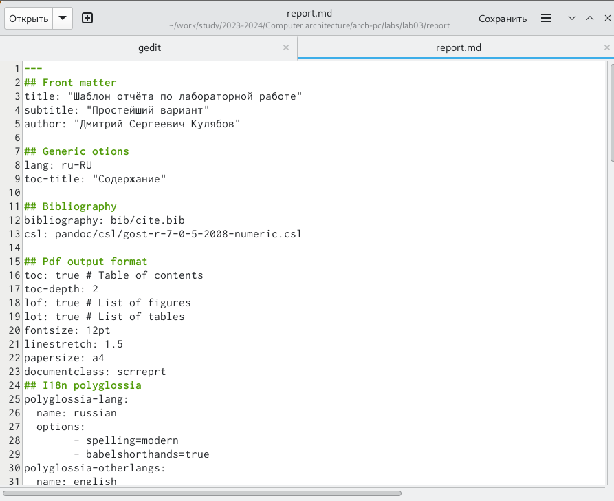
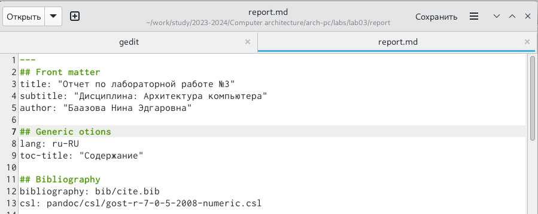
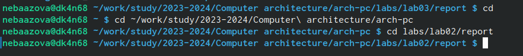
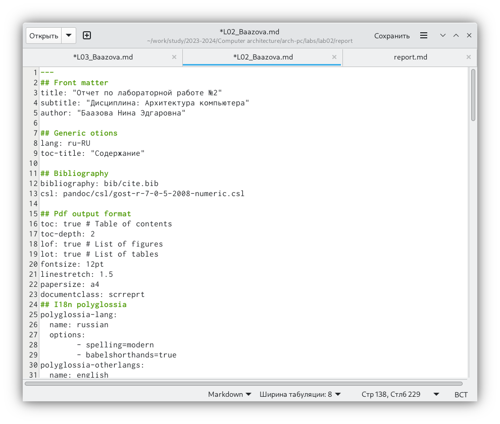
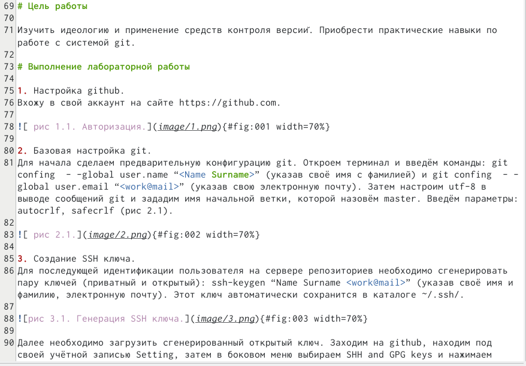

---
## Front matter
title: "Отчет по лабораторной работе №3"
subtitle: "Дисциплина: Архитектура компьютера"
author: "Баазова Нина Эдгаровна"

## Generic otions
lang: ru-RU
toc-title: "Содержание"

## Bibliography
bibliography: bib/cite.bib
csl: pandoc/csl/gost-r-7-0-5-2008-numeric.csl

## Pdf output format
toc: true # Table of contents
toc-depth: 2
lof: true # List of figures
lot: true # List of tables
fontsize: 12pt
linestretch: 1.5
papersize: a4
documentclass: scrreprt
## I18n polyglossia
polyglossia-lang:
  name: russian
  options:
	- spelling=modern
	- babelshorthands=true
polyglossia-otherlangs:
  name: english
## I18n babel
babel-lang: russian
babel-otherlangs: english
## Fonts
mainfont: PT Serif
romanfont: PT Serif
sansfont: PT Sans
monofont: PT Mono
mainfontoptions: Ligatures=TeX
romanfontoptions: Ligatures=TeX
sansfontoptions: Ligatures=TeX,Scale=MatchLowercase
monofontoptions: Scale=MatchLowercase,Scale=0.9
## Biblatex
biblatex: true
biblio-style: "gost-numeric"
biblatexoptions:
  - parentracker=true
  - backend=biber
  - hyperref=auto
  - language=auto
  - autolang=other*
  - citestyle=gost-numeric
## Pandoc-crossref LaTeX customization
figureTitle: "Рис."
tableTitle: "Таблица"
listingTitle: "Листинг"
lofTitle: "Список иллюстраций"
lotTitle: "Список таблиц"
lolTitle: "Листинги"
## Misc options
indent: true
header-includes:
  - \usepackage{indentfirst}
  - \usepackage{float} # keep figures where there are in the text
  - \floatplacement{figure}{H} # keep figures where there are in the text
---

# Цель работы

Освоить процедуры оформления отчетов с помощью легковесного языка разметки Markdown. 

# Задание

1. Заполнение отчета по выполнению лабораторной работы №3 с помощью языка разметки Markdown
2. Задание для самостоятельной работы

# Теоретическое введение

Markdown — облегчённый язык разметки, созданный с целью обозначения форматирования в простом тексте, с максимальным сохранением его читаемости человеком, и пригодный для машинного преобразования в языки для продвинутых публикаций

# Выполнение лабораторной работы

1. Откроем терминал, перейдём в каталог курса, который создали на прошлой лабораторной работе, обновим репозиторий, скачав изменения с помощью команды git pull. Далее перейдем в каталог с шаблоном отчёта по лабораторной работе №3 и проведём компиляцию шаблона с помощью команды make.

{#fig:001 width=70%}
{#fig:002 width=70%}

После проверем наличие файлов в домашней папке

{#fig:003 width=70%}

Следующим шагом удалим полученные файлы report.dock и report.pdf, воспользуясь make clean, затем проверим с помощью ls. 

{#fig:004 width=70%}

Затем откроем report.md с помощью текстового редактора gedit gedit report.md. 

{#fig:005 width=70%}

Далее заполняем отчет и скомпилируем отчет с использованием Makefile. 

{#fig:006 width=70%}

2. В соответствующем каталоге сделаем отчет по лабораторной работе №2 в формате Markfile. 

Мы перейдем каталог лабораторной работы №2 (рис 2.1). Затем откроем L02_Baazova.md и начнем заполнить файл (рис 2.2 и рис 2.3)

{#fig:007 width=70%}
{#fig:008 width=70%}
{#fig:009 width=70%}

# Вывод

Мы освоили процедуры оформления отчетов с помощью легковесного языка разметки Markdown. 

