---
## Front matter
title: "Отчет по лабораторной работе №4"
subtitle: "Дисциплина: Архитектура компьютера"
author: "Баазова Нина Эдгаровна"

## Generic otions
lang: ru-RU
toc-title: "Содержание"

## Bibliography
bibliography: bib/cite.bib
csl: pandoc/csl/gost-r-7-0-5-2008-numeric.csl

## Pdf output format
toc: true # Table of contents
toc-depth: 2
lof: true # List of figures
lot: true # List of tables
fontsize: 12pt
linestretch: 1.5
papersize: a4
documentclass: scrreprt
## I18n polyglossia
polyglossia-lang:
  name: russian
  options:
	- spelling=modern
	- babelshorthands=true
polyglossia-otherlangs:
  name: english
## I18n babel
babel-lang: russian
babel-otherlangs: english
## Fonts
mainfont: PT Serif
romanfont: PT Serif
sansfont: PT Sans
monofont: PT Mono
mainfontoptions: Ligatures=TeX
romanfontoptions: Ligatures=TeX
sansfontoptions: Ligatures=TeX,Scale=MatchLowercase
monofontoptions: Scale=MatchLowercase,Scale=0.9
## Biblatex
biblatex: true
biblio-style: "gost-numeric"
biblatexoptions:
  - parentracker=true
  - backend=biber
  - hyperref=auto
  - language=auto
  - autolang=other*
  - citestyle=gost-numeric
## Pandoc-crossref LaTeX customization
figureTitle: "Рис."
tableTitle: "Таблица"
listingTitle: "Листинг"
lofTitle: "Список иллюстраций"
lotTitle: "Список таблиц"
lolTitle: "Листинги"
## Misc options
indent: true
header-includes:
  - \usepackage{indentfirst}
  - \usepackage{float} # keep figures where there are in the text
  - \floatplacement{figure}{H} # keep figures where there are in the text
---

# Цель работы

Освоение процедуры компиляции и сборки программ, написанных на ассемблере NASM

# Задание

1. Выполнение порядка лабораторной рабоы №4
2. Задание для самостоятельной работы

# Теоретическое введение

Язык ассемблера (assembly language, сокращённо asm) — машинно-ориентированный
язык низкого уровня. Можно считать, что он больше любых других языков приближен к
архитектуре ЭВМ и её аппаратным возможностям, что позволяет получить к ним более
полный доступ, нежели в языках высокого уровня, таких как C/C++, Perl, Python и пр.

NASM — это открытый проект ассемблера, версии которого доступны под различные
операционные системы и который позволяет получать объектные файлы для этих систем. В
NASM используется Intel-синтаксис и поддерживаются инструкции x86-64.
Типичный формат записи команд NASM имеет вид:
[метка:] мнемокод [операнд {, операнд}] [; комментарий ]

# Выполнение лабораторной работы

1. Порядок выполнения лабораторной работы:

1.1 Программа "Hello world!"

Создадим каталог для работы с программами на языке ассемблер NASM, используя команду mkdir -p ~/work/arch-pc/lab04. Затем переходим в него и создаём текстовый файл с именем hello.asm, после открываем редактор gedit (рис 1) и вводим в него следующее (рис 2):

{#fig:001 width=70%}
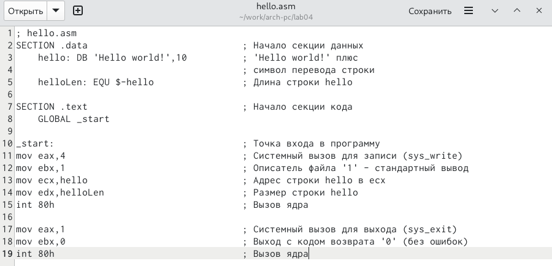{#fig:002 width=70%}

1.2 Транслятор NASM.

Он представляет текст программы в объектный код. Для нашего текста программы введём команду nasm -f elf hello.asm. Ключ -f указывает транслятору, что требуется создать
бинарные файлы в формате ELF. Следует отметить, что формат elf64 позволяет создавать
исполняемый код, работающий под 64-битными версиями Linux. Для 32-битных версий ОС
указываем в качестве формата просто elf.

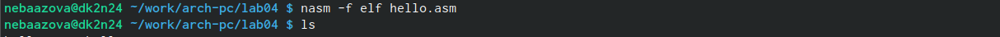{#fig:003 width=70%}
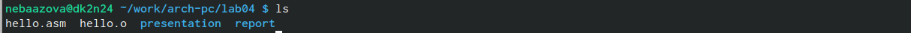{#fig:004 width=70%}

1.3 Разширенный синтаксис командой строки NASM.

Выполним комаду nasm -o obj.o elf -g -l list.lst hello.asm, скомпилируем исходный файл в obj.o и создаем файл листинга list.lst.

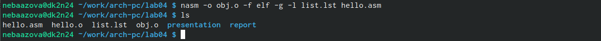{#fig:005 width=70%}

1.4 Компоновщик LD. 

Чтобы получить исполняемую программу, нужно передать на обработку объектный файл компоновщику, используя команду (ld -m elf_i386 hello.o -o hello) и проверяя ls. Затем в вводим команду (ld -m elf_i386 obj.o -o main), где объектный файл будет obj.o, а исполняемый main, и тоже проверяем.

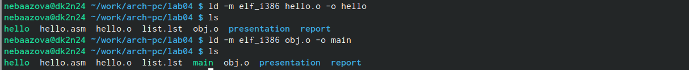{#fig:006 width=70%}

1.5 Запуск исполняемого файла.

Чтобы запустить исполняемый файл, который находится в текущем каталоге, следует набрать в командой строке: ./hello.

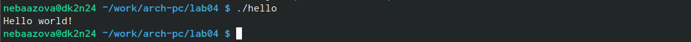{#fig:007 width=70%}

ВЫВОД: Мы написали программу "Hello world!" на языке ассемблера NASM.

2. Задание для самостоятельной работы:

2.1 В текущем каталоге создаем копию файла hello.asm с именем lab4.asm с помощью команды cp, проверяя эфетивность команды командой ls. Затем открываем текстовой редактор gedit. 

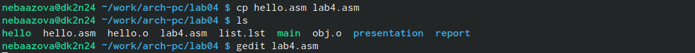{#fig:008 width=70%}

2.2 Вносим туда свою фамилию и имя вместо "Hello world!".

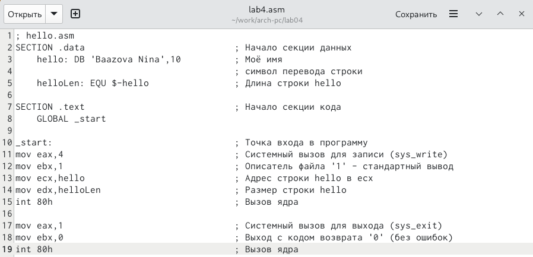{#fig:009 width=70%}

2.3 Оттранслируем полученный текст программы lab4.asm в объектный файл, затем выполним его компоновку и запустим полученный исполняемый файл.

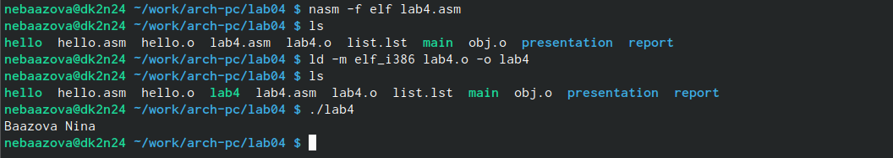{#fig:010 width=70%}

2.4 Теперь скопируем файлы hello.asm и lab4.asm в наш локальный репозиторий в каталог ~/work/study/2023-2024/"Computer architecture"/arch-pc/labs/lab04/ и проверяем ls. Затем удалим лишнии файлв в каталоге ~/work/arch-pc/lab04/

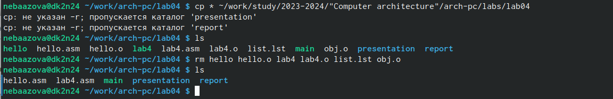{#fig:011 width=70%}

Загрузим файлв на github.

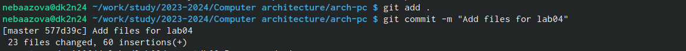{#fig:012 width=70%}
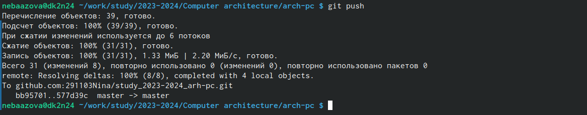{#fig:013 width=70%}

ВЫВОД: Мы выполнили задание для самостоятельной работы.

# Вывод лабораторной работы

Мы освоили процедуры компиляции и сборки программ, написанных на ассемблере NASM.
