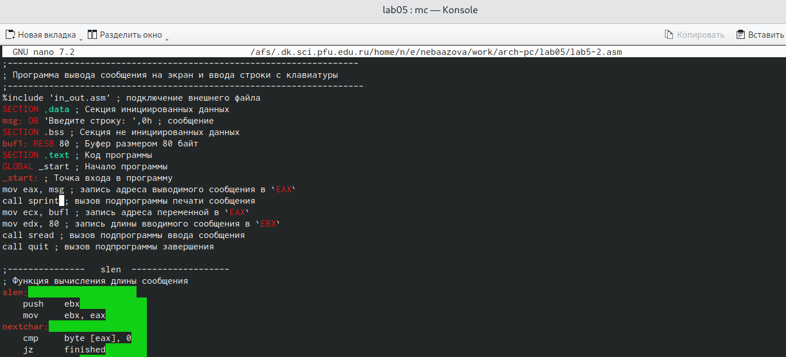

---
## Front matter
title: "Отчет по лабораторной работе №5"
subtitle: "Дисциплина: Архитектура компьютера"
author: "Баазова Нина Эдгаровна"

## Generic otions
lang: ru-RU
toc-title: "Содержание"

## Bibliography
bibliography: bib/cite.bib
csl: pandoc/csl/gost-r-7-0-5-2008-numeric.csl

## Pdf output format
toc: true # Table of contents
toc-depth: 2
lof: true # List of figures
lot: true # List of tables
fontsize: 12pt
linestretch: 1.5
papersize: a4
documentclass: scrreprt
## I18n polyglossia
polyglossia-lang:
  name: russian
  options:
	- spelling=modern
	- babelshorthands=true
polyglossia-otherlangs:
  name: english
## I18n babel
babel-lang: russian
babel-otherlangs: english
## Fonts
mainfont: PT Serif
romanfont: PT Serif
sansfont: PT Sans
monofont: PT Mono
mainfontoptions: Ligatures=TeX
romanfontoptions: Ligatures=TeX
sansfontoptions: Ligatures=TeX,Scale=MatchLowercase
monofontoptions: Scale=MatchLowercase,Scale=0.9
## Biblatex
biblatex: true
biblio-style: "gost-numeric"
biblatexoptions:
  - parentracker=true
  - backend=biber
  - hyperref=auto
  - language=auto
  - autolang=other*
  - citestyle=gost-numeric
## Pandoc-crossref LaTeX customization
figureTitle: "Рис."
tableTitle: "Таблица"
listingTitle: "Листинг"
lofTitle: "Список иллюстраций"
lotTitle: "Список таблиц"
lolTitle: "Листинги"
## Misc options
indent: true
header-includes:
  - \usepackage{indentfirst}
  - \usepackage{float} # keep figures where there are in the text
  - \floatplacement{figure}{H} # keep figures where there are in the text
---

# Цель работы

Приобретение практических навыков работы в Midnight Commander. Освоение инструкций
языка ассемблера mov и int.

# Задание

1. Выполнение порядка лабораторной рабоы №5
2. Задание для самостоятельной работы

# Теоретическое введение

Midnight Commander (или просто mc) — это программа, которая позволяет просматривать
структуру каталогов и выполнять основные операции по управлению файловой системой,
т.е. mc является файловым менеджером. Midnight Commander позволяет сделать работу с
файлами более удобной и наглядной.

# Выполнение лабораторной работы

1. Порядок выполнения лабораторной работы:

1.1   Откроем Midnight Commander с помощью команды mc. Используя клавиши  ↑ , ↓ и Enter , перейдём в каталог ~/work/arch-pc , созданный при выполнении лабораторной работы №4. Затем с помощью функциональной клавиши F7 создаем папку lab05 и перейдем в созданный каталог.

{#fig:001 width=70%}

1.2   Используя строку ввода и командой touch, создайем файл lab5-1.asm 

{#fig:002 width=70%}

1.3   С помощью функциональной клавиши F4 откроем файл lab5-1.asm для редактирова-
ния во встроенном редакторе. Используем редактор nano. Введем текст программы из листинга 5.1, сохраним изменения и закроем файл.

{#fig:003 width=70%}

1.4   С помощью функциональной клавиши F3 откроем файл lab5-1.asm для просмотра.
Убедимся, что файл содержит текст программы.

{#fig:004 width=70%}

1.5   Оттранслируем текст программы lab5-1.asm в объектный файл. Выполним компо-
новку объектного файла и запустим получившийся исполняемый файл. Программа выводит строку 'Введите строку:' и ожидает ввода с клавиатуры. На запрос введите "Ваши ФИО".

{#fig:005 width=70%}

2.1   Подключение внешнего файла in_out.asm: 
Для начала скачаем файл in_out.asm
cо страницы курса в ТУИС, затем подключим его. Но нужно помнить, что in_out.asm должен лежать в том же каталоге, что и файл с программой, в которой он используется.

В одной из панелей mc откроем каталог с файлом lab5-1.asm. В другой панели каталог
со скаченным файлом in_out.asm (для перемещения между панелями используем Tab).
Скопируем файл in_out.asm в каталог с файлом lab5-1.asm с помощью функциональной
клавиши F5.

С помощью функциональной клавиши F6 создайем копию файла lab5-1.asm с именем
lab5-2.asm. Выделяем файл lab5-1.asm, нажимаем клавишу F6 , вводим имя файла
lab5-2.asm и нажимаем клавишу Enter.

{#fig:006 width=70%}

2.2   Исправим текст программы в файле lab5-2.asm с использование подпрограмм из
внешнего файла in_out.asm (используем подпрограммы sprintLF, sread и quit) в
соответствии с листингом 5.2.

{#fig:007 width=70%}

Создаем исполняемый файл и проверьте его работу.

{#fig:008 width=70%}

2.3   В файле lab5-2.asm заменим подпрограмму sprintLF на sprint. Создаем исполняе-
мый файл и проверьте его работу. 

В чем же разница?
А разница в том, что sprintLF переводит на следующую строку, а sprint не переводит.

ВЫВОД: Мы ознакомились с работой в Midnight Commander, научились подключать внешний файл in_out.asm.

2. Задание для самостоятельной работы:

1.1    Создаем копию файла lab5-1.asm. Вносим изменения в программу (без использова-
ния внешнего файла in_out.asm), так чтобы она работала по следующему алгоритму:
• вывести приглашение типа “Введите строку:”;
• ввести строку с клавиатуры;
• вывести введённую строку на экран.

{#fig:009 width=70%}

Получим исполняемый файл и проверим его работу. На приглашение ввести строку
введем свое имя и фамилию.

{#fig:010 width=70%}

1.2   Создаем копию файла lab5-2.asm. Исправим текст программы с использование под-
программ из внешнего файла in_out.asm, так чтобы она работала по следующему
алгоритму:
• вывести приглашение типа “Введите строку:”;
• ввести строку с клавиатуры;
• вывести введённую строку на экран.

{#fig:011 width=70%}

Создаем исполняемый файл и проверяем его работу.

{#fig:012 width=70%}

ВЫВОД: Мы выполнили задание для самостоятельной работы.

# Вывод лабораторной работы

Мы приобрели практические навыки работы в Midnight Commander и освоили инструкции
языка ассемблера mov и int.
